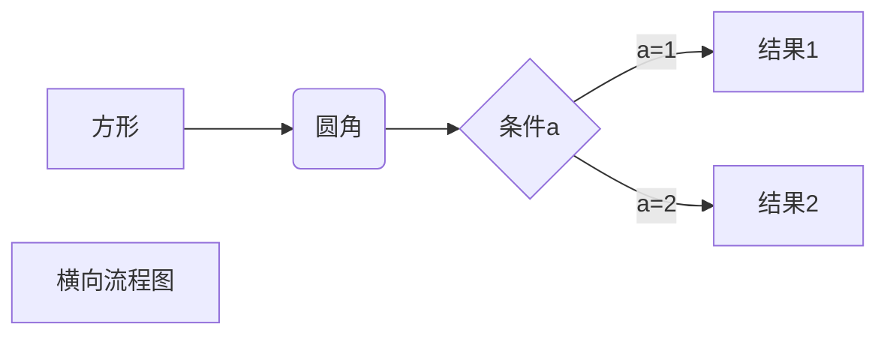

makedown

这是展示的一级标题
==

这是展示的二级标题
--

---


# 一级标题

## 二级标题
### 三级标题
#### 四级标题
##### 五级标题
###### 六级标题
---

正文

段落
RUNOOB.COM  

简单点谁画的番薯简单点哈比哈比哈比你好世界我不好  

---
*斜体文本*
_斜体文本_


**粗体文本**
__粗体文本__

***粗斜体***
___粗斜体___
~~删除线~~
<u>下划线<u>

---
***

* * *

*****

- - -

----------

---

这是脚注的示例[^角标]
[^角标]： 这是角标

> 这是markdown 标准写法不知为何马克飞象此处显示不出来

---
* 第一项
* 第二项
* 第三项

+ 第一项
+ 第二项
+ 第三项

- 第一项
- 第二项
- 第三项

---

1. 第一项
    1. 子项
        - 第二子项
2. 第三子项
3. 

---
##区块
> 一级区块
> > 二级区块
> >
> > > 三级区块

---
>区块中使用列表
>1.  一级区块
>2.  二级区块
>3. 三级区块

> 无序区块

---
`代码`
`code printf("hello world!") `

```       
代码区块

```

---
链接

[链接名称](www.baidu.com)
或者
<https://www.baidu.com>

----
高级链接 (变量)

这个链接用1作为网变量[baidu][1]
这个链接runoob作为网络变量[Runoob][runoob]
然后在文档的结尾变量赋值
[1]:https://www.baidu.com
[runoob]:http:www.runoob.com

- - -
图片


- - -
表格
| 表头   | 表头哈哈哈啊哈哈 |
| ------ | ---------------- |
| 单元格 | 单元格           |


| 左对齐 | 右对齐 | 居中对齐 |
| :----- | -----: | :------: |
| 单元格 | 单元格 |  单元格  |
| 单元格 | 单元格 |  单元格  |


高级技巧

<kbd>CTRL</kbd>
<kbd>Ctrl</kbd> + <kbd>S</kbd>

转义

** 文本加粗 **
\*\* 正常显示星号 \*\*

公式
@(数学表示)[TeX|LaTeX]

当你需要在编辑器中插入数学公式时，可以使用两个美元符 $$ TeX或者LaTeX格式的数学公式来实现。提交后，问答和文章页会根据需要加载 Mathjax 对数学公式进行渲染

$$
\mathbf{V}_1 \times \mathbf{V}_2 =  \begin{vmatrix} 
\mathbf{i} & \mathbf{j} & \mathbf{k} \\
\frac{\partial X}{\partial u} &  \frac{\partial Y}{\partial u} & 0 \\
\frac{\partial X}{\partial v} &  \frac{\partial Y}{\partial v} & 0 \\
\end{vmatrix}
$$

流程图 typora

