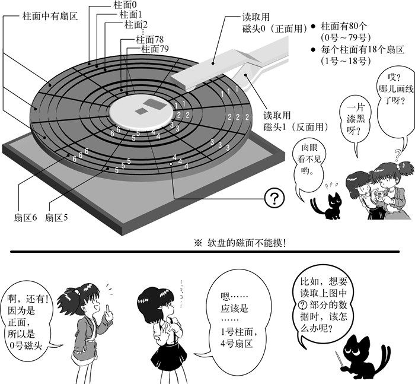
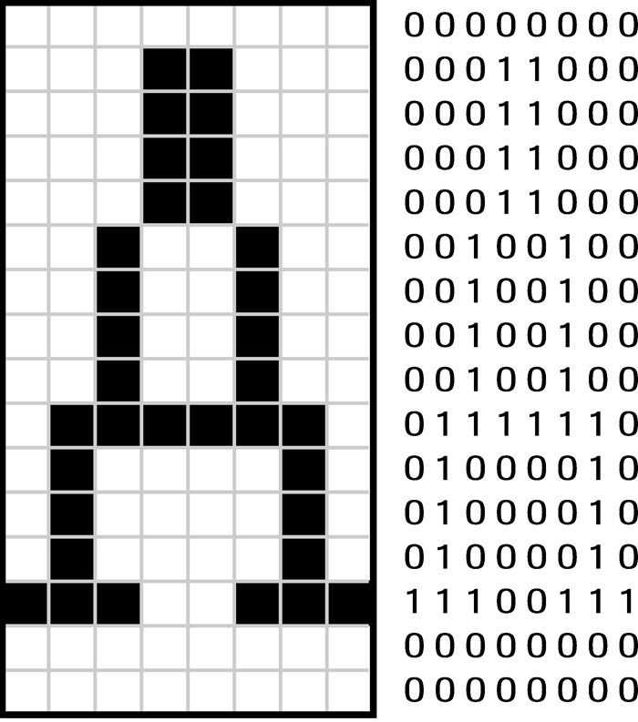

#30天自制操作系统
(X86采用小端模式 最低有效字节在低位地址)

### **启动顺序**

自己使用二进制编辑器直接编写机器代码，保存为.img格式，将其拷贝进软盘，开机设置软盘为第一启动项，开机后会直接顺序执行软盘上的程序。也可以从其他设备启动，启动过程都差不多：

1. 通电

2. 读取ROM里面的BIOS，用来检查硬件

3. 硬件检查通过

4. **BIOS根据指定的顺序，检查引导设备的第一个扇区（即主引导记录），将这一扇区内容加载到内存地址 0x7C00**

5. 主引导记录把操作权交给操作系统

   **启动区**（boot sector）软盘第一个的扇区称为启动区。那么什么是扇区呢？计算机读写软盘的时候，并不是一个字节一个字节地读写的，而是以512字节为一个单位进行读写。因此,软盘的512字节就称为一个扇区。一张软盘的空间共有1440KB，也就是1474560字节，除以512得2880，这也就是说一张软盘共有2880个扇区。那为什么第一个扇区称为启动区呢？那是因为计算机首先从最初一个扇区开始读软盘，然后去检查这个扇区最后2个字节的内容。
   如果这最后2个字节不是0x55 AA，计算机会认为这张盘上没有所需的启动程序，就会报一个不能启动的错误。（也许有人会问为什么一定是0x55 AA呢？那是当初的设计者随便定的，笔者也没法解释）。如果计算机确认了第一个扇区的最后两个字节正好是0x55 AA，那它就认为这个扇区的开头是启动程序，并开始执行这个程序

   我们必须保证软盘的第510字节（即第0x1fe字节）开始的地方是55 AA

   **IPL**  initial program loader的缩写。启动程序加载器。启动区只有区区512字节，实际的操作系统不像hello-os这么小，根本装不进去。所以几乎所有的操作系统，都是把加载操作系统本身的程序放在启动区里的。有鉴于此，有时也将启动区称为IPL。

### 简易汇编

**DB** (define byte):往文件里直接写入一个字节的指令 **DW** 一个字（两个字节）  **DD** 二个字（4个字节）
**RESB** (reserve byte) :空出n个字节 RESB 10(空出10个字节)
$它的其中一种含义是代表文件在其前面的字节数


**MV**指令是仅次于DB指令的汇编命令
MOV AX,0  相当于AX=0；MOV SS,AX

**AC**:累加寄存器  AL  AH
**DX**数据寄存器  DL  DH
**CX**计数寄存器  CL   CH
**BX**基址寄存器  BL   BH

SP 栈指针寄存器   以下4个不区分高位个低位如想获取高低位先mov到上面4个寄存器了
BP
SI
DI


以上8个寄存器皆为16位寄存器
"ADD CX, 0x1234"编译成机器语言后为81 C1 34 12
32位寄存器  EAX ECX EDX EBX ESP EBP ESI EDI
64位 暂且不议

#### 段寄存器segment register

ES		附加段寄存器
CS		代码段寄存器
SS			栈 段寄存器
DS		数据段寄存器
FS			XX
GS		   XX

（标号即内存地址）
JMP 0x7c50  ：跳到这个地址去执行该地址程序
JMP entry entry其实本质上就是0x7c50 它是根据ORG地址和现在文本的位置编译器本身计算的

MOV SI,msg    msg 其实是0x7c74   此命令就是把ox7c74代入到si寄存器内


**MOV**指令的数据源和目的地不仅可以是寄存器(AX)或常数(0x43 ；10)还可以是内存地址（[内存地址]） BYTE [SI]  WORD [BX]

**BYTE  WORD DWORD**均是汇编保留字
MOV BYTE [678],123

### **启动区**

编写汇编文件  用nask编译器编译成二进制文件  写入磁盘映像   装入虚拟机 运行

**Makefile**

Makefile是一个非常聪明的批处理文件的软件，Makefile的写法相当简单。首先生成一个不带扩展名的文件Makefile，然后再用文本编辑器写入以下内容

```
#文件生成规则

ipl.bin : ipl.nas Makefile
    ../z_tools/nask.exe ipl.nas ipl.bin ipl.lst

helloos.img : ipl.bin Makefile
    ../z_tools/edimg.exe   imgin:../z_tools/fdimg0at.tek \
        wbinimg src:ipl.bin len:512 from:0 to:0   imgout:helloos.img
```

make.exe不仅仅判断输入文件是否存在，还会判断文件的更新日期，并据此来决定是否需要重新生成输出文件

Makefile比批处理文件高明，但每次都输入“make -r helloos.img”的话也很麻烦，其实有个可以省事的窍门。当然，可以将“make -r helloos.img”这个命令写成makeimg.bat，但这么做还是离不开批处理文件，所以我们换个别的方法，在Makefile里增加如下内容。

```
#命令
img :
    ../z_tools/make.exe -r helloos.img
```

修改之后，我们只要输入“make img”，就能达到与“make -r helloos.img”一样的效果。这样就省事多了可以把把所有的批处理文件删除，换成下面

```
asm :
    ../z_tools/make.exe -r ipl.bin

run :
    ../z_tools/make.exe img
    copy helloos.img ..\z_tools\qemu\fdimage0.bin
    ../z_tools/make.exe -C ../z_tools/qemu

install :
    ../z_tools/make.exe img
    ../z_tools/imgtol.com w a: helloos.img
```

总结：make软件对.bat批处理命令进行了抽象 在其上又形成了一种命令规则 用于组织和链接批处理命令

makefile使用变量

```
TOOLPATH = ../z_tools/
MAKE     = $(TOOLPATH)make.exe -r
NASK     = $(TOOLPATH)nask.exe
EDIMG    = $(TOOLPATH)edimg.exe
IMGTOL   = $(TOOLPATH)imgtol.com
COPY     = copy
DEL      = del

# 默认动作

default :
	$(MAKE) img

# 文件生成

ipl.bin : ipl.nas Makefile
	$(NASK) ipl.nas ipl.bin ipl.lst

haribote.img : ipl.bin Makefile
	$(EDIMG)   imgin:../z_tools/fdimg0at.tek \
		wbinimg src:ipl.bin len:512 from:0 to:0   imgout:haribote.img

# 命令
asm :
	$(MAKE) ipl.bin

img :
	$(MAKE) haribote.img

run :
	$(MAKE) img
	$(COPY) haribote.img ..\z_tools\qemu\fdimage0.bin
	$(MAKE) -C ../z_tools/qemu

install :
	$(MAKE) img
	$(IMGTOL) w a: haribote.img

clean :
	-$(DEL) ipl.bin
	-$(DEL) ipl.lst

src_only :
	$(MAKE) clean
	-$(DEL) haribote.img

```


### 从汇编导入c语言



磁头是个针状的磁性设备，既可以从软盘正面接触磁盘，也可以从软盘背面接触磁盘。与光盘不同，软盘磁盘是两面都能记录数据的。因此我们有正面和反面两个磁头，分别是磁头0号和磁头1号。


最后我们看一下扇区。指定了柱面和磁头后，在磁盘的这个圆环上，还能记录很多位信息，按照整个圆环为单位读写的话，实在有点多，所以我们又把这个圆环均等地分成了几份。软盘分为18份，每一份称为一个扇区。一个圆环有18个扇区，分别称为扇区1、扇区2、……扇区18。扇区在英文中是sector，意思是指领域、扇形。


综上所述，1张软盘有80个柱面，2个磁头，18个扇区，且一个扇区有512字节。所以，一张软盘的容量是：


80×2×18×512 = 1 474 560 Byte = 1 440KB


含有IPL的启动区，位于C0-H0-S1（柱面0，磁头0，扇区1的缩写），下一个扇区是C0-H0-S2。这次我们想要装载的就是这个扇区。

```
CYLS	EQU		10

		ORG		0x7c00			; 相对开始地址


entry:
		MOV		AX,0			; 初始化
		MOV		SS,AX
		MOV		SP,0x7c00
		MOV		DS,AX

; ディスクを読む

		MOV		AX,0x0820           
		MOV		ES,AX             ;[ES:BX]将软盘的第二扇区里数据放到地址[ES:BX]开始的内存 
		;第一扇区是开机自动加载到内存0x7c00开始的内存也就是现在正在写的这个汇编文件会被
		;编译成机器码加载到ox7c00           0x00007c00-0x00007dff：读取引导扇区的地址 
		MOV		CH,0			; 柱面0
		MOV		DH,0			; 磁头0
		MOV		CL,2			; 扇区2

readloop:
		MOV		SI,0			;记录失败次数的寄存器
retry：
		MOV		AH,0x02			; AH=0x02 : 读磁盘
		MOV		AL,1			; 连续处理的扇区数
		MOV		BX,0
		MOV		DL,0x00			; A驱动器
		INT		0x13			; 调用bios内的例程
		JNC		next           ;jump if not carry flag（CF） cf=1  调用失败
		
		ADD		SI,1
		CMP		SI,5
		JAE		error                 ;jump if above or equal
		
		MOV 	AH,0x00
		MOV		DL,0x00
		INT		0x13                  ;重置驱动器
		JMP		retry

next:
		MOV		AX,ES              ;把内存地址后移0x200      512个字节
		ADD		AX,0x0020
		MOV 	ES,AX
		
		ADD		CL,1                ;以此类推了18个扇区，
		;我们已经把磁盘上C0-H0-S2到C0-H0-S18的512×17=8704字节的内容，装载到了内存的0x8200～0xa3ff处
		CMP		CL,18
		JBE		readloop            ;below or equal   小于或等于
		;取完正面18个扇区开始取反面
		
		MOV 	CL,1			;扇区1
		ADD		DH,1          	;磁头1
		CMP 	DH,2
		JB		readloop
		
		MOV		DH,0
		ADD		CH,1
		CMP		CH,CYLS
		JB		readloop

fin:
		HLT						; cpu休眠
		JMP		fin				; 無限休眠

error:
		MOV		SI,msg
putloop:
		MOV		AL,[SI]
		ADD		SI,1			; SI+1
		CMP		AL,0
		JE		fin
		MOV		AH,0x0e			; 一文字表示ファンクション
		MOV		BX,15			; カラーコード
		INT		0x10			; ビデオBIOS呼び出し
		JMP		putloop
msg:
		DB		0x0a, 0x0a		; 改行を2つ
		DB		"load error"
		DB		0x0a			; 改行
		DB		0

		RESB	0x7dfe-$		; 0x7dfeまでを0x00で埋める命令

		DB		0x55, 0xaa


```


将 ipl  的二进制文件
和编写的系统的二进制文件 
烧录进 映像文件

相当于 第一个扇区存的是ipl的启动数据    系统二进制数据并不是紧挨着IPl的数据存储的。而是在0x002600
位置存储着文件名， 0x004200存储这文件数据                 （类似与文件索引表那种感觉）

以上内容可以总结为：一般向一个空软盘保存文件时，
文件名会写在0x002600以后的地方；
文件的内容会写在0x004200以后的地方。

疑問是這樣的：首先，磁盤映像文件img的0x2600這個地方存儲着操作系統文件的名稱（用二進制編輯器看），0x4200以后存儲着操作系統的內容（執行代碼），我們的啟動區代碼會被加載到內存的0x7c00這個位置，即0x7c00-0x7cff屬於啟動區代碼所有，而書上說0x8000-0x81ff屬於啟動區，究竟哪段地址屬於啟動區，這是疑問一。我們的是從第二扇區將磁盤內容讀取到內存，第一扇區留給啟動區的，我們將第二扇區的內容加載到內存的0x8200以后的地方，那么磁盤映像文件img中0x4200對應的內存地址應該是0x8200+0x4200而不是0x8000+0x4200，相信大家第一次讀這本書或者對操作系統加載原理不理解的人都會至少有這么兩個疑問吧。下面就為大家詳細講解。先上圖，這個圖是百度百科上借鑒的，我修改了一下：


首先，機器啟動，會加載磁盤第一個扇區512字節的內容，判斷是否是啟動程序。而我們磁盤映像文件的對應的第一扇區的匯編地址是0-0x200，即512字節，啟動的時候就是讀取這512字節，這個不是關鍵，關鍵的是我們是從磁盤的第二扇區開始將磁盤的內容加載到內存0x8200以后的位置，所以磁盤映像文件img中0x4200對應的內存地址是0x4200-0x0200+0x8200而不是簡單的0x8000+0x4200,雖然結果一樣，但是筆者卻給我們不懂操作系統的學者造成了一個誤區。哎，關鍵的地方還得自己去認真思考。

32位模式，指的是**CPU的模式**。CPU有16位和32位两种模式。如果以16位模式启动的话，用AX和CX等16位寄存器会非常方便，但反过来，像EAX和ECX等32位的寄存器，使用起来就很麻烦32位模式中，机器语言的命令代码不一样。同样的机器语言，解释的方法也不一样，所以16位模式的机器语言在32位模式下不能运行，反之亦然

用32位模式就不能调用BIOS功能了。这是因为BIOS是用16位机器语言写的。如果我们有什么事情想用BIOS来做，那就全部都放在开头先做，因为一旦进入32位模式就不能调用BIOS函数了，也有从32位返回到16位的方法，但是非常费工夫，

```
; haribote-os
; TAB=4
		CYLE    EQU     0x0ff0            ;设定保存区
		LEDS    EQU     0x0ff1
		VMODE   EQU     0x0ff2          ; 关于颜色数目的信息。颜色的位数。
		SCRNX   EQU     0x0ff4          ; 分辨率的X（screen x）
		SCRNY   EQU     0x0ff6          ; 分辨率的Y（screen y）
		VRAM    EQU     0x0ff8          ; 图像缓冲区的开始地址


        ORG     0xc200          ;这个程序将要被装载到内存的什么地方呢？

        MOV     AL,0x13         ; VGA显卡，320x200x8位彩色
        MOV     AH,0x00
		INT     0x10
		MOV     BYTE [VMODE],8  ; 记录画面模式
        MOV     WORD [SCRNX],320
        MOV     WORD [SCRNY],200
        MOV     DWORD [VRAM],0x000a0000

;用BIOS取得键盘上各种LED指示灯的状态
        MOV     AH,0x02
        INT     0x16            ; keyboard BIOS
        MOV     [LEDS],AL
fin:
        HLT
        JMP     fin
```

看一下程序就能明白，设置画面模式之后，还把画面模式的信息保存在了内存里。这是因为，以后我们可能要支持各种不同的画面模式，这就需要把现在的设置信息保存起来以备后用。我们暂且将启动时的信息称为BOOT_INFO。INFO是英文information（信息）的缩写

[VRAM]里保存的是0xa0000。在电脑的世界里，VRAM指的是显卡内存（video RAM），也就是用来显示画面的内存。这一块内存当然可以像一般的内存一样存储数据，但VRAM的功能不仅限于此，它的各个地址都对应着画面上的像素，可以利用这一机制在画面上绘制出五彩缤纷的图案。


其实VRAM分布在内存分布图上好几个不同的地方。这是因为，不同画面模式的像素数也不一样。当画面模式为〇×时使用这个VRAM；而画面模式为◇△时可能使用那个VRAM，像这样，不同画面模式可以使用的内存也不一样。所以我们就预先把要使用的VRAM地址保存在BOOT_INFO里以备后用。

这次VRAM的值是0xa0000。这个值又是从哪儿得来的呢？还是来看看我们每次都参考的（AT）BIOS支持网页。在INT 0x10的说明的最后写着，这种画面模式下“VRAM是0xa0000～0xaffff的64KB”。


另外，我们还把画面的像素数、颜色数，以及从BIOS取得的键盘信息都保存了起来。保存位置是在内存0x0ff0附近。从内存分布图上看，这一块并没被使用，所以应该没问题。

事实上这也正是使用C语言的不便之处。目标文件是一种特殊的机器语言文件，必须与其他文件链接（link）后才能变成真正可以执行的机器语言。

为了将目标文件与别的目标文件相链接，除了机器语言之外，其中还有一部分是用来交换信息的。单个的目标文件还不是独立的机器语言，其中还有一部分是没完成的。为了能做成完整的机器语言文件，必须将必要的目标文件全部链接上。完成这项工作的，就是obj2bim。bim是笔者设计的一种文件格式，意思是“binary image”，它是一个二进制映像文件

实际上bim文件也“不是本来的状态，而是一种代替的形式”，也还不是完成品。这只是将各个部分全部都链接在一起，做成了一个完整的机器语言文件，而为了能实际使用，我们还需要针对每一个不同操作系统的要求进行必要的加工，比如说加上识别用的文件头，或者压缩等

在video模式下显示字符，本质上是从显存（0x13模式）0xa0000存入信息     8*16 16个字节  每个字节8位



​	

```
static char font_A[16] = {
    0x00, 0x18, 0x18, 0x18, 0x18, 0x24, 0x24, 0x24,
    0x24, 0x7e, 0x42, 0x42, 0x42, 0xe7, 0x00, 0x00
};
```


```
void putfont8(char *vram, int xsize, int x, int y, char c, char *font)
{
    int i;
    char d; /* data */
    for (i = 0; i < 16; i++) {     //16个字节转换为8*16个字节，每个字节里填的是该像素的颜色值
        d = font[i];
        if ((d & 0x80) != 0) { vram[(y + i) * xsize + x + 0] = c; }
        if ((d & 0x40) != 0) { vram[(y + i) * xsize + x + 1] = c; }
        if ((d & 0x20) != 0) { vram[(y + i) * xsize + x + 2] = c; }
        if ((d & 0x10) != 0) { vram[(y + i) * xsize + x + 3] = c; }
        if ((d & 0x08) != 0) { vram[(y + i) * xsize + x + 4] = c; }
        if ((d & 0x04) != 0) { vram[(y + i) * xsize + x + 5] = c; }
        if ((d & 0x02) != 0) { vram[(y + i) * xsize + x + 6] = c; }
        if ((d & 0x01) != 0) { vram[(y + i) * xsize + x + 7] = c; }
    }
    return;
}
```


其他的类似显示原理都同上

cli   不允许中断

cti  允许中断

### **GDT与IDT**

解决内存使用冲突（重叠）问题               -> 分段或者分页

所谓分段，打个比方说，就是按照自己喜欢的方式，将合计4GB2的内存分成很多块（block），每一块的起始地址都看作0来处理。这很方便，有了这个功能，任何程序都可以先写上一句ORG 0。像这样分割出来的块，就称为段（segment）。顺便说一句，如果不用分段而用分页3（paging），也能解决问题。

我们用16位的时候曾经讲解过的段寄存器。这里的分段，使用的就是这个段寄存器。但是16位的时候，如果计算地址，只要将地址乘以16就可以了。但现在已经是32位了，不能再这么用了。如果写成“MOV AL,[DS:EBX]”，CPU会往EBX里加上某个值来计算地址，这个值不是DS的16倍，而是DS所表示的段的起始地址。即使省略段寄存器（segment register）的地址，也会自动认为是指定了DS。这个规则不管是16位模式还是32位模式，都是一样的。

按这种分段方法，为了表示一个段，需要有以下信息。


- 段的大小是多少
- 段的起始地址在哪里
- 段的管理属性（禁止写入，禁止执行，系统专用等）

CPU用8个字节（=64位）的数据来表示这些信息。但是，用于指定段的寄存器只有16位。或许有人会猜想在32位模式下，段寄存器会扩展到64位，但事实上段寄存器仍然是16位。

那该怎么办才好呢？可以模仿图像调色板的做法。也就是说，先有一个段号4，存放在段寄存器里。然后预先设定好段号与段的对应关系。

> 4 英文是segment selector，也有译作“段选择符”的。

调色板中，色号可以使用0~255的数。段号可以用0~8191的数。因为段寄存器是16位，所以本来应该能够处理0~65535范围的数，但由于CPU设计上的原因，段寄存器的低3位不能使用。因此能够使用的段号只有13位，能够处理的就只有位于0~8191的区域了。

段号怎么设定呢？这是对于CPU的设定，不需要像调色板那样使用io_out（由于不是外部设备，当然没必要）。但因为能够使用0~8191的范围，即可以定义8192个段，所以设定这么多段就需要8192×8=65 536字节（64KB）。大家可能会想，CPU没那么大存储能力，不可能存储那么多数据，是不是要写入到内存中去呀。不错，正是这样。这64KB（实际上也可以比这少）的数据就称为GDT。GDT是“global（segment）descriptor table”的缩写，意思是全局段号记录表将这些数据整齐地排列在内存的某个地方，然后将内存的起始地址和有效设定个数放在CPU内被称作GDTR5的特殊寄存器中，设定就完成了

另外，IDT是“interrupt descriptor table”的缩写，直译过来就是“中断记录表”。当CPU遇到外部状况变化，或者是内部偶然发生某些错误时，会临时切换过去处理这种突发事件。这就是中断功能。

我们拿电脑的键盘来举个例子。以CPU的速度来看，键盘特别慢，只是偶尔动一动。就算是重复按同一个键，一秒钟也很难输入50个字符。而CPU在1/50秒的时间内，能执行200万条指令（CPU主频100MHz时）。CPU每执行200万条指令，查询一次键盘的状况就已经足够了。如果查询得太慢，用户输入一个字符时电脑就会半天没反应。

要是设备只有键盘，用“查询”这种处理方法还好。但事实上还有鼠标、软驱、硬盘、光驱、网卡、声卡等很多需要定期查看状态的设备。其中，网卡还需要CPU快速响应。响应不及时的话，数据就可能接受失败，而不得不再传送一次。如果因为害怕处理不及时而靠查询的方法轮流查看各个设备状态的话，CPU就会穷于应付，不能完成正常的处理。

正是为解决以上问题，才有了中断机制。各个设备有变化时就产生中断，中断发生后，CPU暂时停止正在处理的任务，并做好接下来能够继续处理的准备，转而执行中断程序。中断程序执行完以后，再调用事先设定好的函数，返回处理中的任务。正是得益于中断机制，CPU可以不用一直查询键盘，鼠标，网卡等设备的状态，将精力集中在处理任务上。

讲了这么长，其实总结来说就是：要使用鼠标，就必须要使用中断。所以，我们必须设定IDT。IDT记录了0～255的中断号码与调用函数的对应关系，比如说发生了123号中断，就调用○×函数，其设定方法与GDT很相似(此处为32位 无法调用16位中断  故引入IDT中断记录表)

**设定GDT和IDT**

```
struct SEGMENT_DESCRIPTOR{
short limit_low, base_low;
    char base_mid, access_right;
    char limit_high, base_high;
};
struct GATE_DESCRIPTOR {
    short offset_low, selector;    
    char dw_count, access_right;
    short offset_high;
};

void init_gdtidt(void)
{
    struct SEGMENT_DESCRIPTOR *gdt = (struct SEGMENT_DESCRIPTOR *) 0x00270000;
    struct GATE_DESCRIPTOR    *idt = (struct GATE_DESCRIPTOR    *) 0x0026f800;
    int i;

    /* GDT的初始化 */
    for (i = 0; i < 8192; i++) {
    set_segmdesc(gdt + i, 0, 0, 0); 
    }
    set_segmdesc(gdt + 1, 0xffffffff, 0x00000000, 0x4092);
    set_segmdesc(gdt + 2, 0x0007ffff, 0x00280000, 0x409a);
    load_gdtr(0xffff, 0x00270000);      //c语言不能给GDTR赋值，所以需要借助实模式的汇编语言

    /* IDT的初始化 */
    for (i = 0; i < 256; i++) {
        set_gatedesc(idt + i, 0, 0, 0);
    }
    load_idtr(0x7ff, 0x0026f800);

    return;
}

void set_segmdesc(struct SEGMENT_DESCRIPTOR *sd, unsigned int limit, int base, int ar)
{
    if (limit > 0xfffff) {
        ar |= 0x8000; /* G_bit = 1 */
        limit /= 0x1000;
    }
    sd->limit_low    = limit & 0xffff;
    sd->base_low     = base & 0xffff;
    sd->base_mid     = (base >> 16) & 0xff;
    sd->access_right = ar & 0xff;
    sd->limit_high   = ((limit >> 16) & 0x0f) | ((ar >> 8) & 0xf0);
    sd->base_high    = (base >> 24) & 0xff;
    return;
}
void set_gatedesc(struct GATE_DESCRIPTOR *gd, int offset, int selector, int ar)
{
    gd->offset_low   = offset & 0xffff;
    gd->selector     = selector;
    gd->dw_count     = (ar >> 8) & 0xff;
    gd->access_right = ar & 0xff;
    gd->offset_high  = (offset >> 16) & 0xffff;
    return;
}
```

```
_load_gdtr:     ; void load_gdtr(int limit, int addr);
        MOV     AX,[ESP+4]      ; limit
        MOV     [ESP+6],AX
        LGDT    [ESP+6]
        RET
```

我们接着昨天继续做鼠标指针的移动。为达到这个目的必须使用中断，而要使用中断，则必须将GDT和IDT正确无误地初始化。那就赶紧使用中断吧……但是，还有一件该做的事没做——还没有初始化PIC。那么我们现在就来做。

所谓PIC是“programmable interrupt controller”的缩写，意思是“可编程中断控制器”。PIC与中断的关系可是很密切的哟。它到底是什么呢？在设计上，CPU单独只能处理一个中断，这不够用，所以IBM的大叔们在设计电脑时，就在主板上增设了几个辅助芯片。现如今它们已经被集成在一个芯片组里了。

PIC是将8个中断信号集合成一个中断信号的装置。PIC监视着输入管脚的8个中断信号，只要有一个中断信号进来，就将唯一的输出管脚信号变成ON