# 汇编

>因本人学习过**计算机组成原理**的相关知识并且在[30天自制操作系统](https://book.douban.com/subject/11530329//)接触过汇编语言；故该笔记为简化笔记用于回忆

- - -

[TOC]

## 误区
这里介绍一些常见的关于硬件和操作系统的误区；*王爽老师*的汇编语言内容是相对于8086CPU硬件介绍的，但不同的硬件体系还是有很大的差别

### 地址线
8086CPU 地址线20根 寻址空间2<sup>20</sup>个
现代硬件地址线还存在32根 64根
地址线的寻址方空间还跟地址线的布置方式有关：像地址线复用

### 寄存器

除了16位寄存器还存在32位寄存器和64位寄存器

AX->EAX

## 1. `Debug`(调试)工具使用方法

- -r  `-R`  用于更改或查看寄存器内容

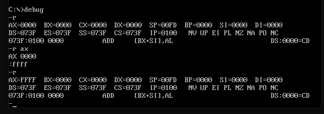


- -d  -D 查看内存中的内容

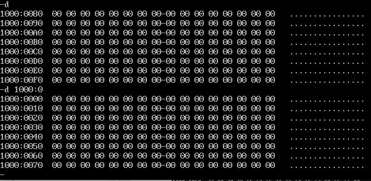


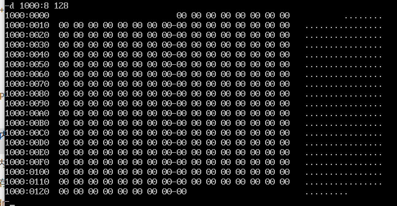

- -e `-E`  改变内存中的内容


- u`-U` 将内存中的机器指令翻译成汇编指令

  

  -u 1000:0   128

- -t `-T`  开始执行下一条机器指令

  

- -a `-A`  以汇编指令的格式往内存里写入一条机器指令

  

- Debug的指令用20多个 常用的是以上6个

## 2. 常用寄存器

`AX` : accmulator  累加寄存器

`CX`: counter 计数寄存器

`DX` :data  数据寄存器

`BX`: base  基址寄存器                                 常用作[bx] mov ax,[bx]

`SP`: stack pointer 栈指针寄存器

`BP`: base pointer 基址指针寄存器

`SI`:  source index 源变址寄存器

`DI`: destination index 目的变址寄存器


段寄存器                                     常用

`CS` :code segment                     CS:IP  执行的指令地址


`DS`: data segment                     DS:BX  需要访问的数据的地址

`SS`：stack  segment                  SS:SP   堆栈地址

`ES`:  extra segment

FS:

FG：

## 3. 常用用法和汇编表示

```
MOV BX, 1000H
MOV DS,BX                            //段寄存器无法直接赋值 需要借助普通寄存器
MOV AL,[0]                           //ds:0 -> al
MOV AL,[BX]                          //ds:bx -> al
MOV AX,[0]                            //只要选择16位寄存器就会传1个字16位
MOV 寄存器，数据                       寄存器<-数据
mov 寄存器，寄存器
mov 寄存器，内存单元        mv ax，[0]
mov 内存单元，寄存器
mov  段寄存器， 寄存器     <->
- - - 
ADD AX,BX
add 寄存器，数据
add 寄存器，寄存器
add 寄存器，内存单元  <->
SUB AX,BX
同add

inc bx      bx  1005H->1006H 
```

## 4. 栈

cpu将内存里的一片内存空间(一般由操作系统安排)作为栈，SS:SP指向栈顶地址(自上而下)  push和pop对栈顶数据进行操作。


`push 寄存器`/段寄存器/内存单元[0]

`pop` 寄存器`/段寄存器/内存单元[0]

## 5. 汇编程序

```
assume cs:codesg                  cs：ox xxxx   ->    内存一个地址

codesg segment                 //定义一个codeseg段  段名 segment  段名 ends
	
	mov  ax,0123h
	mov bx,0456h
	add ax,bx
	add ax,ax
	
	mov ax,4c00h                           //执行返回
	int 21h
	
codesg ends

end
```

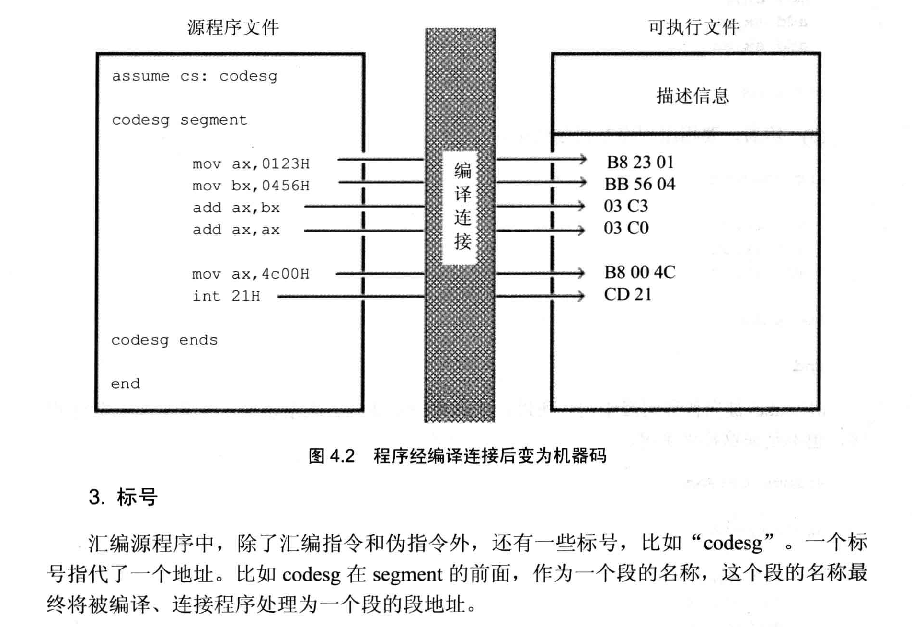

## 6. EXE文件的加载方式

操作系统环境中，合法的通过操作系统获得的空间是安全的，操作系统不会让程序额所用空间冲突；程序获得的空间的方法有两种

一是加载程序的时候为程序分配，二是程序在执行的过程中向操作系统申请。


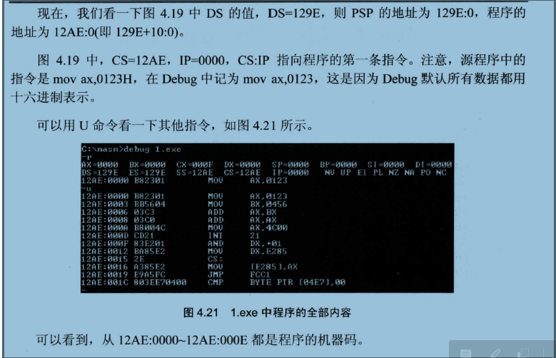

## 7. LOOP

loop 标号

会执行两个步骤

a:cx = cx -1  b:判断cx的值 不为零则跳转至标号处执行程序 为向下执

```
s: mov dl,[bx]

mov es:[bx],dl
inc bx 
loop s

```

## 8. 其他指令

`DB`   'hello world'   `DB` 23H ffH eeH  //字节型   db 1  dw 1 dd 1

`DW `  字型

`DD`  双字型

mov al, 'a'   ->mov al.61H

`and` al，00111011B

`or` al, 00110101B

`si` 和`di` 与bx的功能相近，但是不能分成两个8位寄存器来使用

在没有寄存器名存在的情况下，用操作符 X ptr 指明内存单元的长度，X在汇编指令中可以为word 或byte

mov  word ptr ds:[0],1

inc word ptr [bx]

add word ptr [bx],2

offset   取得标号偏移地址 

start： mov ax,0

​             mov  ax，offset start


乘 `mul reg  mul 内存单元`  8位：  al * reg（8位）/内存单元(字节) ->ax 

​                                         16位：  ax * reg（16位）/内存单元(字)   ->高位放在DX中 低位放在AX中

## 9. 寻址方式 

段地址(SA)和偏移地址(EA)


[bx/si/di]   [bx/si/di + static]  [bx + si/di]   [bx + si/di + static]

在8086cpu内只用 bx si di bp可以使用`[ ]`来寻址


## 10. jmp指令

jmp 本质上是修改 cs:ip

jmp指令要给出两种信息：

(1)转移的目的地址（2）转移额距离（段间转移、段内短转移、段内近转移）

- 段内短转移  ```jmp short 标号```  ip向前或向后（127字节）转移不超过128字节
- 段间转移`jmp far ptr 标号` 功能如下用标号的的段地址和偏移地址替换cs和ip地址

- 寄存器转移 `jmp reg`    ->ip = 16位reg
- 内存转移   `jmp word ptr ds：[8]`内存单元   ->ip（段内转移）
- `jmp dword ptr ds:[2]`  ->高地放到段地址 低地址放偏移地址（段间转移）

条件跳转所有的条件转移都是短转移（ip 8位转移） 

jcxz   （cx =0  跳转）

## 11. CALL 和RET

call和ret也都是转移指令 他们都修改ip或同时修改cs和ip。

`ret`(出栈)

`ret`调用栈中的数据，修改ip的内容，从而实现近转移

`retf` 用栈中的数据 修改cs：ip的内容 实现远转移 


`call`(压栈)

1. 将当前IP或cs和ip 压入栈中 (压栈）

2. 转移

   call指令不能实现短转移 除此之外，call指令实现转移的方法和jmp指令的原理相同

`call 标号`   相当于IP入栈`push ip`    然后`jmp near ptr `标号        （单纯ip）

`cal far ptr 标号`       相当于` push cs   push ip  jmp far ptr 标号`

`call 16位 reg`            相当于 `push ip jmp 16位 reg`

## 12. 标志寄存器(flag)

8086CPU的标准寄存器有16位，其中存储的信息通常被称为程序状态字（PSW）


- ZF 零标记位   它记录相关指令执行后，其结果是否为0。若为0，则zf=1 若不为零 zf =0


  mov ax,1

  or ax,0

  执行后zf为0 

- SF 符号标志位   执行结果为负  sf=1

- CF  进位标记位  一般情况下 无符号运算时，记录最高有效位向更高位的进位或从更高位的借位

- OF 溢出标记位   一般情况下记录的是有符号运算结果的溢出情况

- DF 反向标记位 在串处理指令中，控制每次操作后si、di的递增

  --------

`adc`  是带进位加法指令，他利用了cf位上记录的进位值          与之相反的是`sbb`

adc 操作对象1，操作对象2      -> 操作对象1 = 操作对象1 + 2 + cf


`cmp` cmp ax, ax     相当于减法 ax-ax的运算 结果为0 但是并不在ax中保存，仅影响flag的相关各位   指令执行过后 zf=1 pf=1 sf= 0 cf =0 of =0


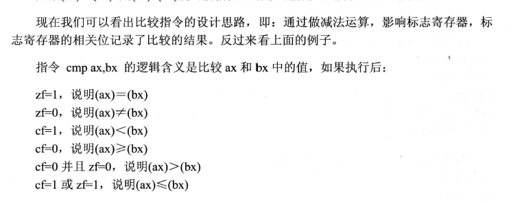

## 13. 中断

任何cpu都具有中断能力，可以在执行完当前正在执行的指令后，（如果有的话）检测到cpu外部或内部的发出的中断电信号，然后保存现在正在执行的程序环境（压栈），转到中断程序去执行，执行完中断程序，后头继续执行原有的程序（出栈）

​      **内中断** cpu内部产生的中断 比如除法错误 单步执行 执行into指令或者执行int指令

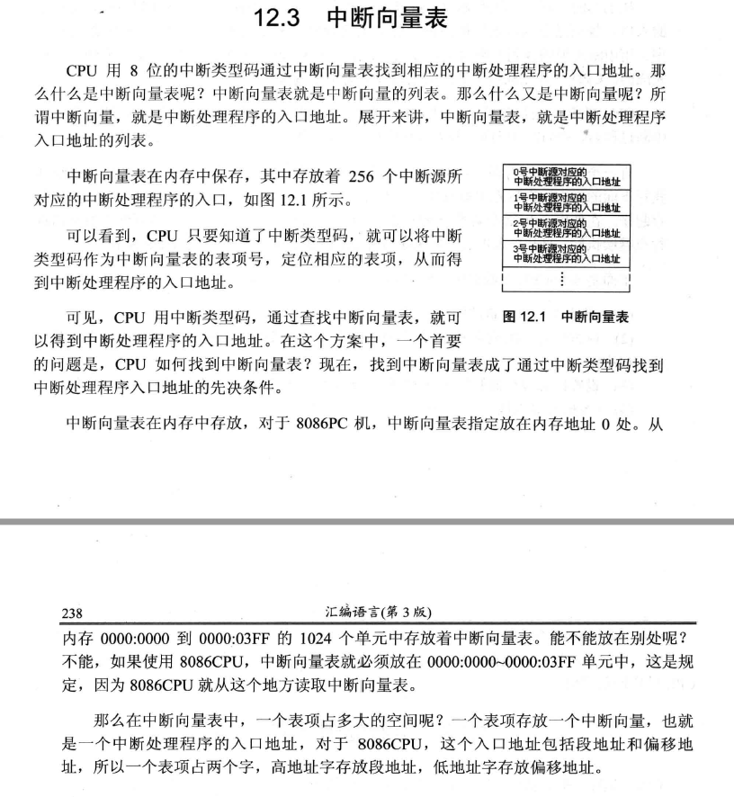

  `int n`  n为中断类型码，他的功能是引发中断过程

BIOS和DOS都提供了一些已经写好的中断例程，在系统版的ROM中存放着一套程序，称为BIOS(基本输入输出系统)，BIOS中主要包含以下几部分内容

- 硬件系统的检测和初始化程序

- 外部中断和内部中断的中断例程

- 用于对硬件设备进行I/Oz操作的中断例程

- 其他硬件系统相关的中断例程

  操作系统Dos也提供了中断例程，提供给程序员；bios和dos在所提供的中断例程中包含了许多子程序，这些子程序实现了程序员在编程的时候经常用到的功能 。程序员用 int

  可直接调用bios和dos提供的中断例程

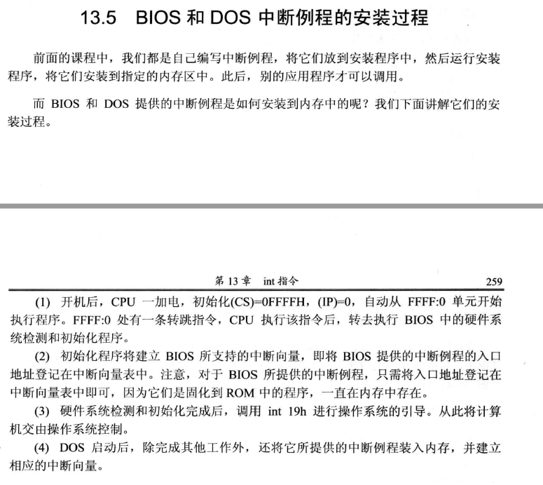

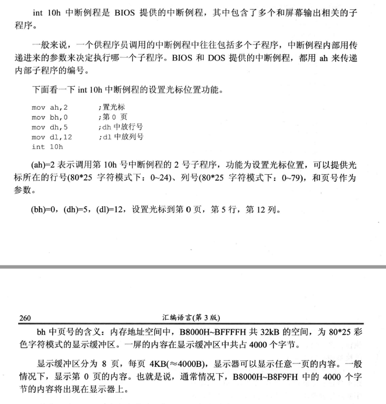

**外中断**  外设发出的中断信号，一般可分成可屏蔽中断和不可屏蔽中断

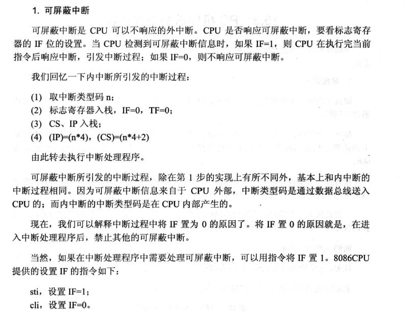

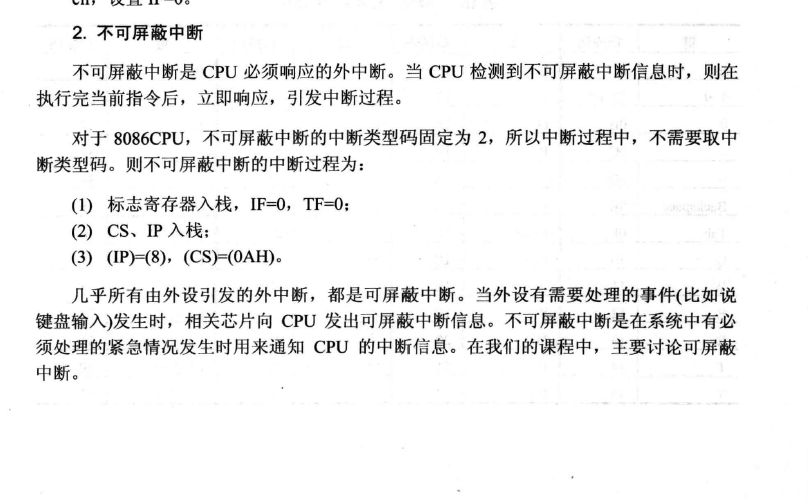

## 14. 端口

端口可以看作外部设备的寄存器，对端口的读写不能用mov push和pop等内存读写指令，只能用 in 和out 

in al,20h              <-

out 20h,al            <-


shr shl 逻辑移位指令

shl al，1  左移一位

## 15. 键盘

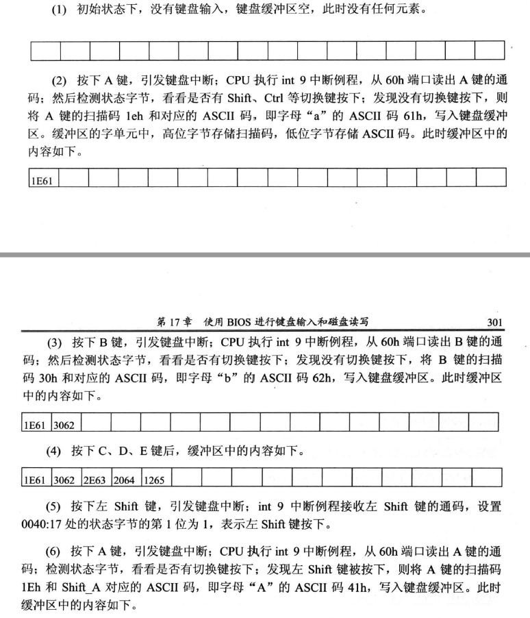

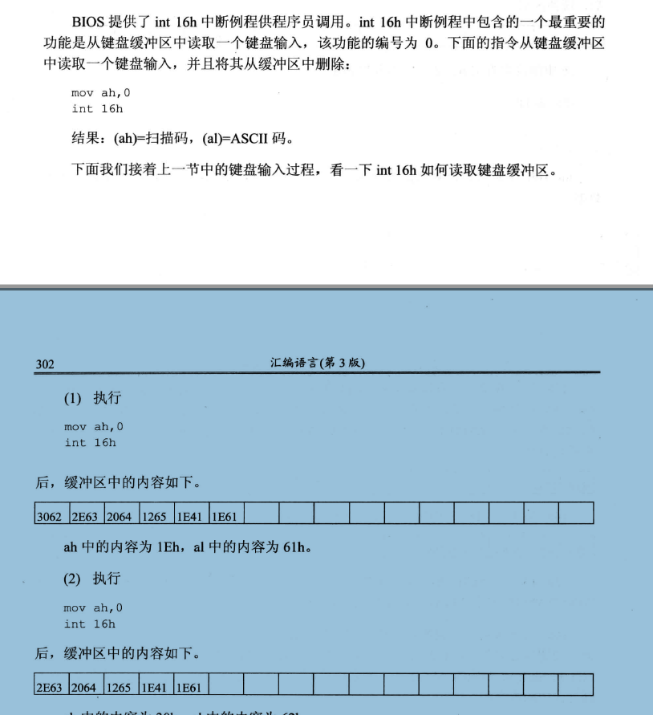